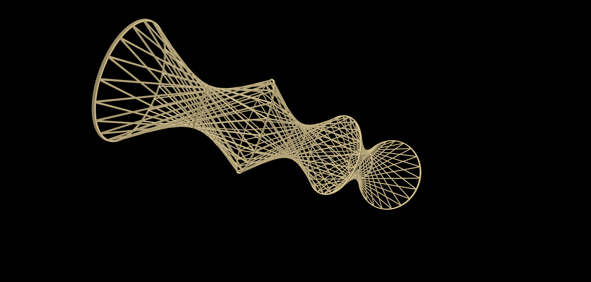

# Procedural CAD Gems: A CadQuery Collection

Welcome to a gallery of parametric 3D models where code meets engineering and art.

### Quick Links
[***Documentation***](https://flightphone.github.io/caddoc)

The Parametric Taj Mahal

Byzantine-Style Central-Plan Basilica

Parametric Spiral Staircase Generator

Parametric Hyperboloid Lattice (Ruled Surface)
